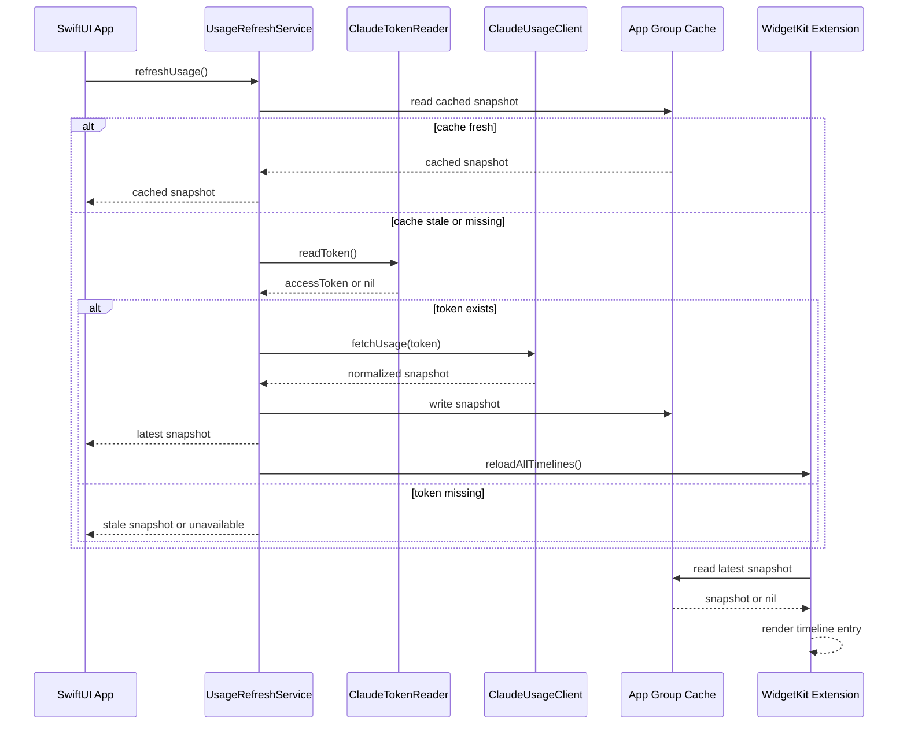

# Claude Code Usage Widget — V0.1 Implementation Spec

## Goal

Build a macOS SwiftUI app with a WidgetKit widget that reads local Claude Code usage information and displays the current usage percentages.

V0.1 only supports Claude Code. It should read the same usage data that Claude Code's `/usage` screen uses, cache it locally, and expose it to a macOS widget.

The target result:

- A macOS menu bar or standard SwiftUI app.
- A WidgetKit extension showing Claude Code usage.
- Usage fields:
  - Weekly "All models" percentage.
  - Optional per-model weekly limits, such as "Fable".
  - Current session percentage.
  - Reset times when available.
- Local-only token access.
- No backend server.
- No telemetry.
- No token upload.

## Non-Goals

V0.1 must not implement:

- Codex usage.
- OpenAI API usage.
- Anthropic API key usage.
- iCloud sync.
- User accounts.
- Public App Store readiness.
- Auto-start LaunchAgent.
- Notifications.
- Multiple Claude accounts.

These can be revisited after the Claude-only MVP works reliably.

## Key Assumptions

Claude Code stores an OAuth credential locally in one of these places:

1. `~/.claude/.credentials.json`
2. macOS Keychain item with service name `Claude Code-credentials`

The usage endpoint is internal and undocumented:

```text
GET https://api.anthropic.com/api/oauth/usage
```

Required request headers:

```text
Authorization: Bearer <accessToken>
anthropic-version: 2023-06-01
anthropic-beta: oauth-2025-04-20
```

Because this endpoint is internal, the app must treat all network/JSON failures as expected recoverable states.

## Product Behavior

### Main App

The main app should:

- Read the Claude Code OAuth token from local credential sources.
- Request current usage from the Claude Code usage endpoint.
- Normalize the response into an internal `ClaudeUsageSnapshot`.
- Cache the latest successful snapshot into an App Group shared container.
- Show a simple status screen:
  - Current weekly usage.
  - Current session usage.
  - Optional scoped model limits.
  - Last updated time.
  - Error state if unavailable.
  - Manual refresh button.
- Trigger widget reload after a successful refresh.

The main app is the only component that should actively refresh usage from the remote endpoint.

### Widget

The widget should:

- Read the latest cached snapshot from the App Group shared container.
- Never require the user to log in separately.
- Never directly read Keychain in V0.1.
- Never directly call the usage endpoint in V0.1.
- Display cached usage data and cache age.
- Show a useful empty/error state when no cached usage exists.

Recommended widget sizes:

- Small widget:
  - Weekly percentage.
  - Session percentage.
- Medium widget:
  - Weekly percentage.
  - Session percentage.
  - One or two scoped weekly model percentages.
  - Reset time.
- Large widget is optional for V0.1.

## Architecture

Use a simple layered architecture.

```text
SwiftUI UI
  ↓
Application Services
  ↓
Domain Models
  ↓
Adapters
  ↓
External Systems
```

### Dependency Direction

UI depends on application services.

Application services depend on domain models and adapter protocols.

Adapters depend on system APIs such as FileManager, Keychain, URLSession, and App Group storage.

Domain models must not import SwiftUI, WidgetKit, Security, or URLSession.

## Core Modules

### 1. Domain

Path:

```text
Shared/Domain
```

Responsibilities:

- Define normalized usage models.
- Define error states.
- Provide pure formatting helpers when appropriate.
- Avoid framework-specific logic.

Core models:

```swift
struct ClaudeUsageSnapshot: Codable, Equatable {
    var available: Bool
    var session: UsageLimit?
    var weekly: UsageLimit?
    var weeklyScoped: [UsageLimit]
    var note: String?
    var fetchedAt: Date
}

struct UsageLimit: Codable, Equatable, Identifiable {
    var id: String
    var kind: String
    var label: String
    var percent: Double
    var resetsAt: Date?
}
```

Expected labels:

- `Session`
- `All models`
- scoped model name, for example `Fable`

Rules:

- Percent is normalized as `Double`.
- Percent should be clamped to `0...100` for display.
- Unknown reset time is allowed.
- Missing session or weekly data should not crash the UI.

### 2. Claude Usage Client

Path:

```text
App/Services/ClaudeUsageClient.swift
```

Responsibilities:

- Call the Claude Code usage endpoint.
- Decode the raw JSON.
- Normalize raw response into `ClaudeUsageSnapshot`.

Inputs:

- OAuth access token.

Outputs:

- `ClaudeUsageSnapshot`

Dependencies:

- `URLSession`

Important behavior:

- Must not throw to UI directly.
- Convert failures into unavailable snapshots or typed errors handled by the app service.
- Handle these cases:
  - HTTP 200 with valid JSON.
  - HTTP 401 token expired.
  - HTTP 429 rate limited.
  - non-JSON response.
  - missing `limits` array.
  - missing `seven_day` fallback.
  - network failure.

Raw response model:

```swift
struct RawUsageResponse: Decodable {
    var limits: [RawLimitEntry]?
    var seven_day: RawSevenDay?
}

struct RawLimitEntry: Decodable {
    var kind: String
    var group: String
    var percent: Double
    var resets_at: Date?
    var scope: RawScope?
    var is_active: Bool?
}

struct RawScope: Decodable {
    var model: RawModel?
}

struct RawModel: Decodable {
    var display_name: String?
}

struct RawSevenDay: Decodable {
    var utilization: Double?
    var resets_at: Date?
}
```

Mapping rules:

- `kind == "session"` becomes label `Session`.
- `kind == "weekly_all"` becomes label `All models`.
- `kind == "weekly_scoped"` uses `scope.model.display_name` if present, otherwise `Weekly`.
- `weekly` should prefer `weekly_all`.
- If `weekly_all` is missing, fall back to `seven_day.utilization`.
- `weeklyScoped` should include all `weekly_scoped` entries.

### 3. Token Reader

Path:

```text
App/Services/ClaudeTokenReader.swift
```

Responsibilities:

- Read local Claude Code OAuth token.
- Try sources in priority order.
- Return `nil` when no token is found.

Token sources:

1. Credentials file:

```text
~/.claude/.credentials.json
```

2. macOS Keychain generic password:

```text
service: Claude Code-credentials
```

Supported JSON structures:

```json
{
  "claudeAiOauth": {
    "accessToken": "..."
  }
}
```

or:

```json
{
  "accessToken": "..."
}
```

Rules:

- Do not log the token.
- Do not persist the token into the App Group cache.
- Do not expose the token to the widget.
- Do not show the token in UI.
- If the credentials file cannot be read, silently fall back to Keychain.
- If Keychain cannot be read, return `nil`.

macOS sandbox note:

V0.1 can be implemented as a non-sandboxed developer tool first.

If app sandboxing is enabled, direct access to `~/.claude/.credentials.json` may fail. In that case, add a user-selected file access flow later. Do not add this complexity in V0.1 unless required.

### 4. Usage Refresh Service

Path:

```text
App/Services/UsageRefreshService.swift
```

Responsibilities:

- Orchestrate token read, endpoint request, cache write, and widget reload.
- Apply cache TTL and rate-limit protection.
- Coalesce concurrent refreshes.

Inputs:

- Manual refresh request.
- App startup refresh.
- Timer-based refresh while app is open.

Outputs:

- Latest `ClaudeUsageSnapshot`.

Dependencies:

- `ClaudeTokenReader`
- `ClaudeUsageClient`
- `UsageCacheStore`
- `WidgetCenter`

Refresh rules:

- Default TTL: 5 minutes.
- If cache is fresh, return cached snapshot.
- If HTTP 429 happens, serve stale cache if available.
- Default cooldown after 429: 2 minutes.
- If HTTP 401 happens, show stale cache if available with note:
  - `token expired/unauthorized — open Claude Code to refresh it`
- If no token is found, show stale cache if available with note:
  - `no OAuth token found — log in with Claude Code first`
- If no cache exists, return unavailable snapshot.

Do not request the usage endpoint more often than the TTL unless the user explicitly taps manual refresh.

Even manual refresh should respect 429 cooldown.

### 5. App Group Cache Store

Path:

```text
Shared/Storage/UsageCacheStore.swift
```

Responsibilities:

- Save latest normalized `ClaudeUsageSnapshot`.
- Read latest snapshot for both app and widget.
- Store data in the shared App Group container.

Recommended storage:

```text
App Group container / claude-usage-snapshot.json
```

Required App Group:

```text
group.<bundle-prefix>.ClaudeUsageWidget
```

Replace `<bundle-prefix>` with the real app bundle prefix during implementation.

Rules:

- Cache normalized usage only.
- Never cache OAuth tokens.
- Writes should be atomic.
- Corrupt cache should be ignored safely.
- Widget must degrade gracefully if the cache file does not exist.

### 6. SwiftUI App UI

Path:

```text
App/UI
```

Recommended views:

```text
ContentView.swift
UsageOverviewView.swift
UsageLimitRow.swift
ErrorNoteView.swift
```

Main screen layout:

- Header: `Claude Code Usage`
- Weekly card:
  - `All models`
  - percentage
  - reset time if available
- Session card:
  - percentage
  - reset time if available
- Scoped limits list:
  - each model name
  - percentage
  - reset time if available
- Footer:
  - last updated time
  - refresh button
  - note/error message

Visual rules:

- Keep the UI simple.
- Use native SwiftUI components.
- Use `ProgressView(value:total:)` for usage bars.
- Avoid custom charts in V0.1.
- Avoid complex animations in V0.1.

### 7. Widget Extension

Path:

```text
Widget
```

Responsibilities:

- Read cached usage snapshot.
- Render usage summary.
- Show placeholder and empty states.

Widget provider flow:

1. `placeholder`
2. `getSnapshot`
3. `getTimeline`
4. Read cache from App Group.
5. Build widget entry.
6. Set next refresh date.

Timeline refresh recommendation:

- `Date().addingTimeInterval(15 * 60)`

This is only a requested refresh time. The system may refresh later.

Widget states:

#### Normal

Show:

- `Claude Code`
- Weekly percentage.
- Session percentage.
- Cache age.
- Optional reset time.

#### No Cache

Show:

- `Open app to load Claude usage`

#### Error With Stale Cache

Show cached data plus a small note:

- `Cached`
- cache age

#### Unavailable Without Cache

Show:

- `Usage unavailable`
- short reason if it fits.

## Data Flow



## Recommended Folder Structure

```text
ClaudeUsageWidget/
├─ ClaudeUsageWidget.xcodeproj
├─ Shared/
│  ├─ Domain/
│  │  ├─ ClaudeUsageSnapshot.swift
│  │  ├─ UsageLimit.swift
│  │  └─ UsageDisplayFormatting.swift
│  ├─ Storage/
│  │  └─ UsageCacheStore.swift
│  └─ Constants/
│     └─ AppGroup.swift
│
├─ App/
│  ├─ ClaudeUsageWidgetApp.swift
│  ├─ UI/
│  │  ├─ ContentView.swift
│  │  ├─ UsageOverviewView.swift
│  │  ├─ UsageLimitRow.swift
│  │  └─ ErrorNoteView.swift
│  └─ Services/
│     ├─ ClaudeTokenReader.swift
│     ├─ ClaudeUsageClient.swift
│     └─ UsageRefreshService.swift
│
├─ Widget/
│  ├─ ClaudeUsageWidgetBundle.swift
│  ├─ ClaudeUsageWidget.swift
│  ├─ ClaudeUsageTimelineProvider.swift
│  ├─ ClaudeUsageWidgetEntryView.swift
│  └─ ClaudeUsageWidgetEntry.swift
│
└─ Tests/
   ├─ DomainTests/
   ├─ ServiceTests/
   └─ StorageTests/
```

## Implementation Details

### Date Decoding

The usage endpoint returns ISO timestamps.

Use `JSONDecoder.dateDecodingStrategy = .iso8601`.

If parsing fails because the timestamp format includes fractional seconds, add a custom ISO8601 decoder that supports:

```text
yyyy-MM-dd'T'HH:mm:ss.SSSXXXXX
yyyy-MM-dd'T'HH:mm:ssXXXXX
```

### Keychain Reading

Use Security framework.

Read generic password by service:

```text
Claude Code-credentials
```

The Keychain value may itself be JSON. Parse it with the same token extraction logic used for the credentials file.

### Credentials File Reading

Expand home path using:

```swift
FileManager.default.homeDirectoryForCurrentUser
```

Path:

```text
.claude/.credentials.json
```

Do not require this file to exist.

### Refresh Trigger Points

Refresh usage when:

- App launches.
- User taps refresh.
- App becomes active and cache is stale.
- Optional timer fires while app is open.

Do not refresh from widget directly in V0.1.

### Cache Freshness

A cached snapshot is fresh when:

```text
now - fetchedAt < 5 minutes
```

The widget should display cache age even when stale.

### Percent Display

Rules:

- Round to nearest integer for primary display.
- Use `31% used`.
- Do not show excessive decimals.
- Clamp visual progress to `0...100`.
- If percent is missing, show `—`.

### Reset Time Display

Rules:

- If reset time is today, show relative time such as `in 2h`.
- If reset time is later, show short date/time.
- If reset time is missing, hide the reset label.

## Error Handling

Represent errors as user-readable notes. Avoid fatal errors.

Required error notes:

```text
no OAuth token found — log in with Claude Code first
token expired/unauthorized — open Claude Code to refresh it
rate limited — showing cached data
usage response was not JSON
usage endpoint returned HTTP <status>
request failed: <message>
```

Do not show raw tokens, full request headers, or full credential file contents.

## App Permissions and Capabilities

Required:

- App Group capability for both app target and widget target.
- Outgoing network access.

Potentially required depending on sandbox setting:

- Disable sandbox for V0.1 developer build, or
- Add file access flow for `~/.claude/.credentials.json`.

Recommended V0.1 approach:

- Start as a local developer app without App Store sandbox constraints.
- Add sandbox compatibility later only if needed.

## Testing Strategy

### Unit Tests

Test pure mapping logic:

- `session` limit maps to label `Session`.
- `weekly_all` maps to label `All models`.
- `weekly_scoped` maps to model display name.
- missing model display name maps to `Weekly`.
- missing `weekly_all` falls back to `seven_day`.
- missing `limits` does not crash.
- percent values are clamped for display.
- bad dates are handled safely if custom date parsing is implemented.

### Token Reader Tests

Use fixture strings for token extraction:

- nested `claudeAiOauth.accessToken`
- top-level `accessToken`
- invalid JSON
- missing token
- empty token

Avoid testing real user Keychain in unit tests. Put Keychain access behind a small protocol if needed.

### Cache Store Tests

Use temporary directory or injectable file URL.

Test:

- write snapshot.
- read snapshot.
- corrupt JSON returns nil.
- missing file returns nil.
- token is never stored.

### Service Tests

Use mock token reader, mock usage client, and mock cache store.

Test:

- fresh cache avoids network.
- stale cache triggers network.
- 429 returns stale cache.
- 401 returns stale cache with note.
- no token returns unavailable or stale cache.
- successful refresh writes cache.

### Manual QA

Run these manual cases:

1. Claude Code logged in, credentials available:
   - app shows usage.
   - widget shows usage after reload.
2. Credentials file unavailable but Keychain available:
   - app still shows usage.
3. No credentials:
   - app shows clear unavailable state.
4. Simulated 401:
   - app tells user to open Claude Code.
5. Simulated 429:
   - app shows cached data.
6. Corrupt cache:
   - widget shows empty state, not crash.
7. Widget added before app opened:
   - widget asks user to open app.

## Acceptance Criteria

V0.1 is complete when:

- The macOS app can fetch Claude Code usage from the local OAuth token.
- The app shows weekly, session, and scoped usage values.
- The latest successful usage snapshot is stored in the App Group container.
- The widget reads from the App Group cache.
- The widget displays usage without directly reading Claude credentials.
- Refresh is cached with a default 5-minute TTL.
- HTTP 401 and 429 are handled gracefully.
- No token is written into shared cache or UI.
- The app does not crash when the endpoint response changes shape.
- Unit tests cover response mapping, token extraction, cache read/write, and refresh orchestration.

## Implementation Sequence

### Step 1 — Create Project

Create a macOS SwiftUI app with a Widget Extension.

Enable App Group on both targets.

Create shared folder/module for domain models and cache store.

### Step 2 — Implement Domain Models

Add:

- `UsageLimit`
- `ClaudeUsageSnapshot`
- formatting helpers

Add unit tests for formatting and clamping.

### Step 3 — Implement Cache Store

Add App Group cache read/write.

Use atomic JSON writes.

Add tests with injectable file URL.

### Step 4 — Implement Token Extraction

Add pure token extraction from raw JSON string.

Then add file reader.

Then add Keychain reader.

Keep token extraction separately testable.

### Step 5 — Implement Usage Client

Add raw response models.

Add endpoint call.

Add mapping to normalized snapshot.

Add tests using fixture JSON.

### Step 6 — Implement Refresh Service

Add TTL logic.

Add cooldown after 429.

Add stale cache fallback.

Add widget reload after successful cache write.

### Step 7 — Build App UI

Implement simple SwiftUI dashboard.

Add refresh button.

Show last updated and note states.

### Step 8 — Build Widget UI

Implement small and medium widget.

Read cache only.

Show empty state when no cache exists.

### Step 9 — Manual QA

Test all manual cases listed above.

Confirm no token appears in logs, cache, or UI.

## Future Extensions

Do not implement these in V0.1, but keep the design compatible:

- Provider protocol for multiple usage sources.
- OpenAI API usage provider.
- Codex usage provider if a stable local source is discovered.
- Menu bar extra.
- Notifications when usage exceeds threshold.
- Launch-at-login.
- Sandboxed App Store-compatible credential access.
- Multiple Claude accounts.
- Historical usage chart.

## Security Rules

- Never upload local credentials.
- Never store OAuth token in App Group.
- Never include token in logs.
- Never show raw credential JSON in errors.
- Keep all usage fetching local to the user's Mac.
- Treat internal endpoint failures as normal.
- Do not retry aggressively after 429.
- Do not bypass Claude Code authentication.
