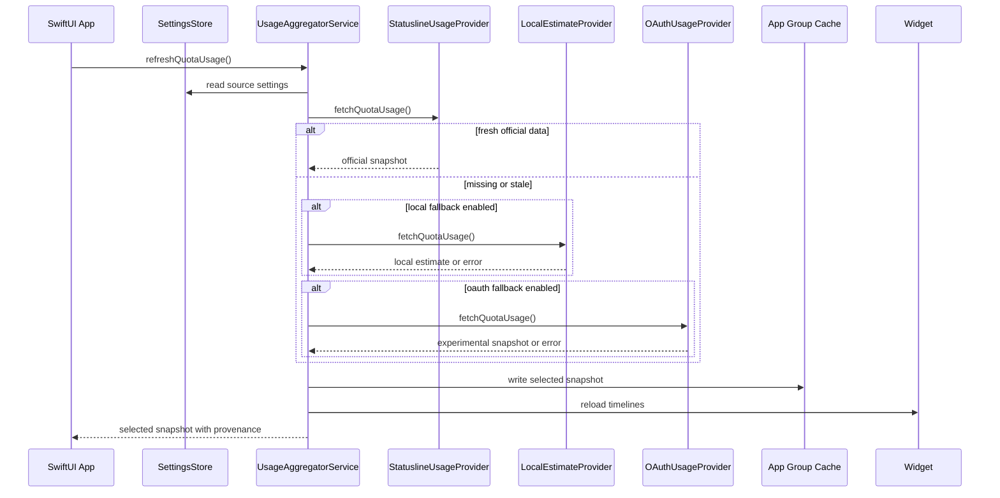
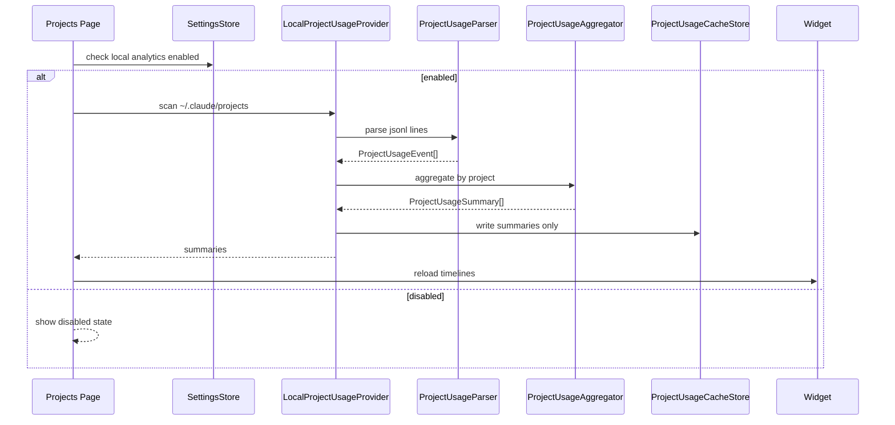

# Claude Code Usage Widget — V0.2 Patch Implementation Spec

## Goal

Implement V0.2 on top of the existing V0.1 SwiftUI macOS app.

V0.2 adds two major capabilities:

1. A clear usage data source strategy:
   - Default source: Claude Code `statusline rate_limits`
   - Optional fallback: local JSONL-derived estimate from `~/.claude/projects`
   - Optional experimental fallback: Anthropic OAuth usage API

2. Local project usage analytics:
   - Read local Claude Code JSONL logs.
   - Aggregate token usage by project.
   - Show per-project token totals in the macOS app.
   - Optionally show top projects in the widget.

V0.2 must preserve the V0.1 behavior and be implemented as a patch, not a rewrite.

## Current V0.1 Baseline

Assume V0.1 already exists and can run.

Existing V0.1 capabilities:

- SwiftUI macOS app.
- WidgetKit widget.
- Claude Code usage display.
- App Group cache.
- Local-only usage fetching.
- Basic refresh behavior.
- Basic error handling.

V0.2 should extend this architecture, not replace it.

## V0.2 Scope

### In Scope

- Add source selection and provider ordering.
- Add Settings UI for data source configuration.
- Add default statusline `rate_limits` provider.
- Keep OAuth provider as optional experimental provider only.
- Add local JSONL project analytics provider.
- Add per-project token aggregation.
- Add Projects page in the app.
- Add optional widget display for top projects.
- Add privacy-first local storage rules.
- Add tests for JSONL parsing, aggregation, deduplication, and source fallback behavior.

### Out of Scope

Do not implement these in V0.2:

- Codex usage.
- OpenAI API usage.
- Cloud sync.
- Account system.
- Cost estimation as a primary feature.
- Historical charts.
- Notifications.
- App Store sandbox hardening.
- Launch-at-login.
- Auto-installing Claude Code hooks without user confirmation.
- Uploading any usage data.

## Data Source Priority

V0.2 must use this source order:

```text
Best source when available:
Claude Code statusline rate_limits

Fallback when enabled:
local JSONL-derived estimate from ~/.claude/projects

Optional experimental fallback when enabled:
Anthropic OAuth usage API
```

Important rule:

The default behavior must only use the first source: statusline `rate_limits`.

The app must not read JSONL logs or OAuth credentials unless the user explicitly enables those options in Settings.

## Feature Split

There are two different concepts in the app.

### 1. Quota / Current Limit Usage

This answers:

- How much of the current Claude Code weekly/session quota is used?
- What percent is left?
- When does it reset?

Primary source:

```text
Claude Code statusline rate_limits
```

Fallback sources:

- JSONL estimate, only if enabled.
- OAuth API, only if enabled and marked experimental.

### 2. Project Usage Analytics

This answers:

- How many tokens did each local project use?
- Which projects used the most tokens today / 7 days / 30 days / all time?
- Which models were used per project?
- When was each project last active?

Primary source:

```text
local JSONL logs under ~/.claude/projects
```

This feature must be opt-in.

Do not use the OAuth endpoint for project analytics.

## User-Facing Settings

Add a Settings screen/page with these controls.

### Usage Source Settings

```text
Quota Source Mode
- Official statusline only
- Statusline, then local estimate if enabled
- Statusline, then local estimate, then experimental OAuth
```

Default:

```text
Official statusline only
```

### Local Project Analytics

```text
Enable Local Project Analytics
```

Default:

```text
Off
```

Description:

```text
Reads local Claude Code JSONL files under ~/.claude/projects to calculate per-project token usage. Prompt and message content are not stored.
```

### Claude Projects Path

Default:

```text
~/.claude/projects
```

Allow the user to override this path later if needed.

For V0.2, a text field is acceptable. A folder picker is optional.

### Experimental OAuth API

```text
Enable Experimental OAuth Usage API
```

Default:

```text
Off
```

Description:

```text
Uses Claude Code's local OAuth token and an undocumented Anthropic usage endpoint. This may break without notice.
```

Require explicit user opt-in.

## Architecture Update

V0.2 should introduce provider-based source selection.

```text
SwiftUI UI
  ↓
UsageDashboardViewModel
  ↓
UsageAggregatorService
  ↓
UsageProvider(s)
  ↓
Statusline / JSONL / OAuth / Cache
```

## New/Updated Modules

### 1. Usage Provider Protocol

Add:

```text
Shared/Providers/UsageProvider.swift
```

Purpose:

Define a common interface for quota usage sources.

Recommended shape:

```swift
protocol UsageProvider {
    var id: UsageProviderID { get }
    var displayName: String { get }
    var provenance: UsageProvenance { get }

    func fetchQuotaUsage() async -> UsageProviderResult<ClaudeUsageSnapshot>
}
```

Supporting models:

```swift
enum UsageProviderID: String, Codable, CaseIterable {
    case statusline
    case localEstimate
    case oauthExperimental
}

enum UsageProvenance: String, Codable {
    case official
    case localEstimate
    case experimental
}

struct UsageProviderResult<Value> {
    var value: Value?
    var error: UsageProviderError?
    var provenance: UsageProvenance
    var fetchedAt: Date
}
```

Rules:

- Providers should not own source ordering.
- Providers should only know how to fetch their own data.
- Source ordering belongs to `UsageAggregatorService`.

### 2. Statusline Usage Provider

Add:

```text
App/Providers/StatuslineUsageProvider.swift
```

Purpose:

Read Claude Code official statusline `rate_limits` data when available.

Expected input source:

V0.2 should support reading from a local state file written by a Claude Code statusline hook.

Recommended default path:

```text
~/.claude-usage-widget/statusline/latest.json
```

If V0.1 already uses a different state file path, preserve that path and add compatibility.

Expected normalized state file format:

```json
{
  "schemaVersion": 1,
  "source": "claude-code-statusline",
  "capturedAt": "2026-07-05T12:00:00Z",
  "rateLimits": {
    "session": {
      "kind": "session",
      "label": "Session",
      "percent": 31,
      "resetsAt": "2026-07-05T16:00:00Z"
    },
    "weekly": {
      "kind": "weekly_all",
      "label": "All models",
      "percent": 42,
      "resetsAt": "2026-07-10T00:00:00Z"
    },
    "weeklyScoped": [
      {
        "kind": "weekly_scoped",
        "label": "Fable",
        "percent": 23,
        "resetsAt": "2026-07-10T00:00:00Z"
      }
    ]
  }
}
```

Implementation notes:

- If the real statusline payload differs, create a mapper layer.
- Do not let UI depend on raw statusline JSON.
- Treat statusline data as stale if `capturedAt` is too old.

Freshness rule:

```text
Fresh if now - capturedAt <= 10 minutes
```

If stale:

- Provider returns an error with `staleData`.
- Aggregator may fall back depending on Settings.

### 3. Local JSONL Project Analytics Provider

Add:

```text
App/Providers/LocalProjectUsageProvider.swift
```

Purpose:

Read Claude Code local JSONL logs and produce per-project token usage summaries.

Default root:

```text
~/.claude/projects
```

Files:

```text
~/.claude/projects/**/*.jsonl
```

This provider is opt-in and must only run when Local Project Analytics is enabled.

Responsibilities:

- Recursively find `.jsonl` files.
- Read files line by line.
- Parse valid JSON lines.
- Extract project, timestamp, model, message/request IDs, and token counts.
- Deduplicate entries.
- Aggregate by project.
- Return summaries by selected time range.

Do not store raw JSONL lines.

Do not store message content.

Do not copy Claude logs into the app cache.

### 4. Project Usage Parser

Add:

```text
Shared/ProjectAnalytics/ProjectUsageParser.swift
```

Purpose:

Parse one JSONL line into a normalized project usage event.

Recommended normalized event:

```swift
struct ProjectUsageEvent: Codable, Equatable, Hashable {
    var stableID: String
    var projectName: String
    var projectPath: String?
    var timestamp: Date?
    var model: String?
    var inputTokens: Int
    var outputTokens: Int
    var cacheCreationTokens: Int
    var cacheReadTokens: Int
    var totalTokens: Int
}
```

Stable ID rules:

Prefer:

```text
message_id + request_id
```

Fallback:

```text
file path + line number
```

If a line has no token counts, ignore it.

Token extraction should support common field variants:

```text
usage.input_tokens
usage.output_tokens
usage.cache_creation_input_tokens
usage.cache_read_input_tokens
message.usage.input_tokens
message.usage.output_tokens
message.usage.cache_creation_input_tokens
message.usage.cache_read_input_tokens
```

Model extraction should support:

```text
model
message.model
request.model
```

Timestamp extraction should support:

```text
timestamp
created_at
message.timestamp
```

Project extraction should support:

```text
cwd
project
project_path
projectPath
workspace.cwd
```

If no project path is found:

- Derive project from the JSONL file path.
- Mark project path as `nil` if not reliably known.

### 5. Project Usage Aggregator

Add:

```text
Shared/ProjectAnalytics/ProjectUsageAggregator.swift
```

Purpose:

Group normalized events into project summaries.

Recommended model:

```swift
struct ProjectUsageSummary: Codable, Equatable, Identifiable {
    var id: String
    var projectName: String
    var projectPath: String?
    var totalTokens: Int
    var inputTokens: Int
    var outputTokens: Int
    var cacheCreationTokens: Int
    var cacheReadTokens: Int
    var messageCount: Int
    var models: [String]
    var firstUsedAt: Date?
    var lastUsedAt: Date?
    var source: UsageProvenance
}
```

ID rule:

```text
stable hash of normalized projectPath if available, otherwise stable hash of projectName
```

Aggregation rules:

- Deduplicate by `stableID`.
- Sum token fields.
- Count unique usage events as `messageCount`.
- Sort by `totalTokens` descending by default.
- Store model names as unique sorted values.
- Track first and last usage timestamps.

### 6. Project Time Range

Add:

```text
Shared/ProjectAnalytics/ProjectUsageTimeRange.swift
```

Recommended enum:

```swift
enum ProjectUsageTimeRange: String, Codable, CaseIterable {
    case today
    case last7Days
    case last30Days
    case all
}
```

Rules:

- Default to `last7Days`.
- Filter by event timestamp.
- If timestamp is missing, include only in `all`.
- Use user's local calendar for `today`.

### 7. Project Analytics Cache

Add:

```text
Shared/Storage/ProjectUsageCacheStore.swift
```

Purpose:

Cache only aggregated summaries.

Recommended file:

```text
App Group container / project-usage-summary.json
```

Stored data:

```swift
struct ProjectUsageCache: Codable {
    var schemaVersion: Int
    var generatedAt: Date
    var rootPath: String
    var timeRange: ProjectUsageTimeRange
    var summaries: [ProjectUsageSummary]
}
```

Rules:

- Never cache raw JSONL.
- Never cache message text.
- Never cache prompt text.
- Never cache tool call details.
- Cache can include project path, but UI should allow hiding full paths later.
- Corrupt cache should be ignored.

### 8. Usage Aggregator Service

Update:

```text
App/Services/UsageAggregatorService.swift
```

Purpose:

Select the best quota source according to settings.

Provider order:

```swift
statusline
localEstimate // only if enabled
oauthExperimental // only if enabled
```

Rules:

- Try statusline first.
- If statusline returns fresh official data, stop.
- If statusline is missing/stale:
  - fall back to local estimate only if user enabled it.
- If local estimate fails:
  - fall back to OAuth only if user enabled experimental OAuth.
- Always record which provider was used.
- UI must display provenance:
  - `Official`
  - `Local estimate`
  - `Experimental`

Important:

Local JSONL-derived quota estimate is separate from project analytics. If implemented in V0.2, it can be simple or omitted. The main V0.2 JSONL requirement is project analytics.

Do not block project analytics on quota source fallback.

## UI Changes

### Navigation

Add app sections:

```text
Overview
Projects
Settings
```

If the app currently has only one screen, add a simple `NavigationSplitView` or tab-style layout.

### Overview Page

Continue showing V0.1 quota usage.

Add provenance label:

```text
Source: Official statusline
```

or:

```text
Source: Local estimate
```

or:

```text
Source: Experimental OAuth
```

If statusline is missing:

```text
Official statusline data not available.
```

If fallback is disabled:

```text
Enable fallback sources in Settings if you want local estimates.
```

### Projects Page

Only available when Local Project Analytics is enabled.

If disabled, show:

```text
Local Project Analytics is off.
Enable it in Settings to calculate per-project token usage from ~/.claude/projects.
```

When enabled, show:

- Time range picker:
  - Today
  - Last 7 days
  - Last 30 days
  - All
- Refresh button.
- Project summary table/list:
  - Project name
  - Total tokens
  - Input tokens
  - Output tokens
  - Cache tokens
  - Message count
  - Last used
  - Models

Recommended default sort:

```text
Total tokens descending
```

Recommended row display:

```text
ProjectName
123,456 tokens · 51 messages · last used 2h ago
Models: Sonnet 4.5, Haiku
```

For privacy, show full project path only in expanded detail or secondary text.

### Settings Page

Add:

- Quota source mode picker.
- Enable Local Project Analytics toggle.
- Claude projects path field.
- Enable Experimental OAuth Usage API toggle.
- Privacy explanation text.
- Button: `Open Claude Projects Folder`
- Button: `Refresh Project Analytics`

## Widget Changes

V0.2 widget should keep V0.1 quota display.

Optional project analytics widget behavior:

If Local Project Analytics is enabled and project cache exists:

- Medium widget may show top 3 projects for selected/default range.
- Default range: last 7 days.
- Show project name and total tokens.
- Do not show full file paths in widget.

Example:

```text
Claude Code
Weekly 42% · Session 31%

Top Projects · 7d
ship-fleet-ac      284k
BoardPro           119k
bead-forge          83k
```

If disabled, widget remains quota-only.

Widget must read only App Group caches.

Widget must not parse JSONL directly.

## Data Flow

### Quota Usage Flow



### Project Analytics Flow



## Privacy and Security Rules

V0.2 must follow these rules:

- Local Project Analytics is off by default.
- JSONL files are only read after explicit user opt-in.
- Raw JSONL is never copied into app storage.
- Prompt text is never stored.
- Message content is never stored.
- Tool call content is never stored.
- OAuth API is off by default.
- OAuth token is never stored in App Group.
- Widget never reads OAuth token.
- Widget never reads JSONL files.
- Widget reads only normalized App Group cache.
- Logs must not include raw JSONL lines.
- Logs must not include OAuth tokens.
- Error messages should be short and non-sensitive.

## Implementation Sequence

### Step 1 — Add Settings Store

Create:

```text
Shared/Settings/UsageSettings.swift
Shared/Settings/UsageSettingsStore.swift
```

Store settings in App Group `UserDefaults`.

Fields:

```swift
struct UsageSettings: Codable, Equatable {
    var quotaSourceMode: QuotaSourceMode
    var localProjectAnalyticsEnabled: Bool
    var claudeProjectsPath: String
    var experimentalOAuthEnabled: Bool
    var projectAnalyticsDefaultRange: ProjectUsageTimeRange
}
```

Default values:

```swift
quotaSourceMode = .officialStatuslineOnly
localProjectAnalyticsEnabled = false
claudeProjectsPath = "~/.claude/projects"
experimentalOAuthEnabled = false
projectAnalyticsDefaultRange = .last7Days
```

### Step 2 — Add Provider Protocols

Add `UsageProvider` for quota usage.

Add a separate `ProjectUsageProvider` if useful:

```swift
protocol ProjectUsageProvider {
    func fetchProjectSummaries(range: ProjectUsageTimeRange) async -> [ProjectUsageSummary]
}
```

### Step 3 — Implement Statusline Provider

Read normalized statusline file.

Validate freshness.

Map to existing `ClaudeUsageSnapshot`.

Add provenance `.official`.

### Step 4 — Move Existing OAuth Logic Behind Provider

If V0.1 currently uses OAuth directly, wrap that implementation in:

```text
OAuthUsageProvider
```

Mark it as:

```text
provenance = .experimental
```

Only call it when Settings allows.

### Step 5 — Implement JSONL Parser

Implement pure parser first.

Input:

```text
raw JSON string
source file path
line number
```

Output:

```text
ProjectUsageEvent?
```

Ignore invalid lines.

Do not throw for individual bad lines.

### Step 6 — Implement Project Aggregator

Deduplicate events.

Filter by time range.

Group by project.

Sort by total tokens descending.

### Step 7 — Implement Local Project Provider

Recursively scan `~/.claude/projects`.

Parse `.jsonl` files line by line.

Pass events to aggregator.

Write aggregate-only cache.

### Step 8 — Add Projects UI

Add Projects page.

Add disabled state.

Add summary list/table.

Add time range picker.

Add manual refresh.

### Step 9 — Add Settings UI

Add toggles and descriptions.

Make settings changes persistent.

When enabling Local Project Analytics, do not immediately scan if this would surprise the user. Prefer a clear button:

```text
Enable and Scan
```

or after enabling, show:

```text
Click Refresh to scan local logs.
```

### Step 10 — Update Widget

Read quota cache as before.

Read project analytics cache if available.

Show top projects only if analytics is enabled.

Keep small widget quota-only.

Use medium widget for top projects.

### Step 11 — Tests

Add tests listed below.

## Test Plan

### Settings Tests

- Default settings are safe.
- Local analytics defaults to off.
- Experimental OAuth defaults to off.
- Settings persist and reload.

### Statusline Provider Tests

- Valid fresh statusline file returns official snapshot.
- Missing file returns error.
- Stale file returns stale error.
- Invalid JSON returns parse error.
- Missing rate limits returns unavailable.

### JSONL Parser Tests

Use fixture JSONL lines.

Test:

- extracts `usage.input_tokens`
- extracts `usage.output_tokens`
- extracts cache creation tokens
- extracts cache read tokens
- extracts nested `message.usage`
- extracts model from supported locations
- extracts timestamp from supported locations
- extracts project from `cwd`
- extracts project from `project_path`
- extracts project from `workspace.cwd`
- ignores invalid JSON
- ignores line with no token usage
- creates fallback stable ID from file path and line number

### Project Aggregator Tests

- groups by project.
- sums token fields.
- deduplicates by stable ID.
- sorts by total tokens descending.
- filters today.
- filters last 7 days.
- filters last 30 days.
- includes unknown timestamp only in all-time.
- tracks first and last usage.
- produces unique sorted model names.

### Cache Tests

- writes project summary cache.
- reads project summary cache.
- corrupt project cache returns nil.
- raw message content is not present in encoded cache fixture.

### Service Tests

- official statusline is selected when fresh.
- local fallback is not used when disabled.
- OAuth fallback is not used when disabled.
- local fallback is used when enabled and statusline missing.
- OAuth fallback is used only when explicitly enabled.
- selected provenance is included in UI model.

### Manual QA

Run these cases manually:

1. Fresh statusline data exists:
   - Overview shows official usage.
   - Source label says official.
2. Statusline file missing:
   - Overview shows missing official data.
   - No fallback occurs by default.
3. Enable Local Project Analytics:
   - Projects page scans local logs.
   - Project totals appear.
   - Widget remains stable.
4. Disable Local Project Analytics:
   - Projects page returns to disabled state.
   - Widget hides project section.
5. Enable experimental OAuth:
   - OAuth is only used when statusline/local fallback cannot provide data.
6. Corrupt JSONL file:
   - Scan completes.
   - Bad lines are skipped.
7. Large JSONL directory:
   - App remains responsive.
   - Scan runs off main thread.
8. Widget before analytics scan:
   - Widget shows quota only.
9. No Claude projects directory:
   - Projects page shows clear empty state.

## Performance Requirements

- JSONL scan must not run on the main thread.
- Large files must be read line by line, not loaded completely into memory.
- UI should show scanning progress or at least a loading state.
- Repeated scans should be manually triggered in V0.2.
- Do not implement filesystem watching in V0.2.
- Project cache should be small and aggregate-only.

## Error and Empty States

### Projects Directory Missing

```text
Claude projects folder was not found.
Expected: ~/.claude/projects
```

### Local Analytics Disabled

```text
Local Project Analytics is off.
Enable it in Settings to calculate per-project token usage from local Claude Code logs.
```

### No Usage Events Found

```text
No token usage found for this time range.
```

### Scan Failed

```text
Could not scan Claude project logs.
```

Include a short technical reason only when safe.

## Acceptance Criteria

V0.2 is complete when:

- Default quota behavior uses statusline only.
- Local JSONL reading is off by default.
- OAuth API is off by default and marked experimental.
- Settings control all fallback behavior.
- App can parse local Claude Code JSONL logs after opt-in.
- App can show per-project token totals.
- Aggregation supports Today, Last 7 Days, Last 30 Days, and All.
- Project summaries include total/input/output/cache tokens.
- Project summaries include message count, models, and last used time.
- Widget can optionally show top projects from cached summaries.
- Widget does not read JSONL files directly.
- Raw JSONL content is never cached.
- OAuth token is never exposed to widget or cache.
- Tests cover parsing, aggregation, settings, provider fallback, and cache behavior.

## Recommended Commit Breakdown

Use small commits:

```text
1. add usage settings store
2. add usage provider protocol and provenance models
3. wrap oauth usage as experimental provider
4. add statusline provider
5. add project analytics domain models
6. add jsonl parser
7. add project usage aggregator
8. add local project provider and cache
9. add projects page
10. add settings page
11. update widget project summary display
12. add tests and fixtures
```

## Do Not Change

Preserve V0.1 behavior unless explicitly replaced by this patch.

Do not remove:

- Existing widget cache.
- Existing quota display.
- Existing refresh button.
- Existing error handling.
- Existing App Group setup.

Only refactor existing OAuth code enough to place it behind the new provider system.
